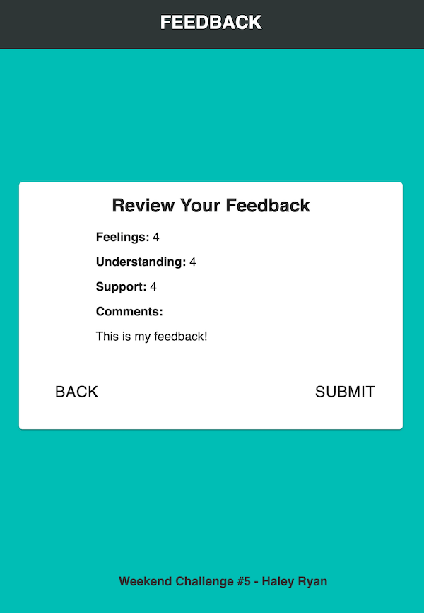

# Redux-Feedback-Loop

_Weekend Challenge_

This full-stack react application collects sequential feedback from users. One component/question is displayed at a time, and upon clicking 'next', the selection/comment for that question is stored in reduxStore. Users can go back and edit choices/comments, and review feedback before submitting it. Submitted feedback is stored in a database. After feedback is submitted, user is prompted to leave new feedback, and the page resets.

This weekend challenge was a chance to practice full-stack react, react routers, redux states, and Material UI styling.





## Technologies Used

- React
- Redux
- Node
- Express
- HTML/CSS
- Material UI
- SQL

## Dependencies
- material-ui
- axios
- pg
- react
- react-dom
- react-redux
- react-router-dom
- redux
- redux-logger
- react-scripts

## Installation

In terminal window or editor of choice, "npm install", "run server", and "run client". Follow instructions below to set up database.

## Database Setup

```SQL

-- Database should be prime_feedback
CREATE DATABASE "prime_feedback";

-- Switch to "prime_feedback" before making:
-- Table to store the feedback
CREATE TABLE "feedback" (
  "id" serial primary key,
  "feeling" INT not null,
  "understanding" INT not null,
  "support" INT not null,
  "comments" text,
  "flagged" boolean default false,
  "date" date not null default CURRENT_DATE
); 

-- Sample feedback item
INSERT INTO "feedback" ("feeling", "understanding", "support", "comments")
VALUES (4, 4, 5, 'Doing Great!');


```